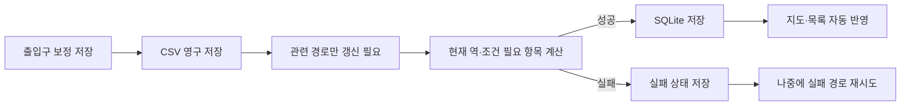

# 부산 도시철도 역세권 수요 탐색 웹서비스 사용자 보고서·기능 명세

작성 기준일: 2026-09-16  
대상 서비스: `app.py`로 실행하는 Streamlit 웹서비스  
대상 독자: 처음 사용하는 분석 담당자, 출입구 보정 담당자, 운영자

## 1. 문서 목적

이 문서는 부산 도시철도 승하차 변화와 역세권 아파트 접근성을 탐색하는 웹서비스의 화면,
사용 절차, 계산 상태와 오류 대응 방법을 설명한다. 이 서비스는 탐색 도구이며 표시된 통계와
주변 아파트만으로 승객 증감이나 부동산 가치의 원인을 자동 확정하지 않는다.

## 2. 가장 빠른 시작

1. 웹서비스에 접속한다.
2. 목적에 맞는 상단 탭을 선택한다.
3. 역세권 아파트를 보려면 `아파트 연결` 탭을 연다.
4. 최초 기본값인 대연역 2호선과 `시간제한·입주민 전용 포함` 체크 상태를 확인한다.
5. 반경과 최소 세대수를 선택한다.
6. 저장된 실제 보행 경로가 있으면 지도와 목록이 즉시 표시된다.
7. 필요한 결과가 없거나 변경되었으면 화면이 해당 항목만 자동 계산한다.
8. 실패 항목이 있으면 `실패 경로 재시도`를 누른다.

직접 실행하는 환경에서는 다음 명령으로 시작한다.

```powershell
.venv\Scripts\python -m streamlit run app.py
```

## 3. 서비스 구성

| 화면 | 주요 기능 | 해석 시 주의점 |
|---|---|---|
| 역세권 지표 | 역별 승하차 규모, 출퇴근 지표, 유형과 지도 | 승차+하차는 고유 이용자 수가 아닌 이용 건수다. |
| 출퇴근 성격 | 시간대와 방향성에 따른 역 특성 | 최신 12개월 평일 자료를 기준으로 한다. |
| 장기 변화 | 월별·연간 승하차 추세 | 미완결 연도와 결측 기간을 확인한다. |
| 뜨는 역·지는 역 | 기간별 증감률·절대 증감 순위 | 순위는 원인이나 투자 성과를 의미하지 않는다. |
| 상세 원인 탐색 | 증가 시점, 시간대, 사건, 비교역, 원인 후보 | 시간적 동시성이 인과관계를 증명하지 않는다. |
| 아파트 연결 | 실제 보행거리, 출입구 보정, 지도 경로 | 직선거리를 실제 보행거리로 대체하지 않는다. |
| 데이터 상태 | 품질 요약, 원본 파일, 관측 범위 | 분석 전에 최신 관측일과 제외 사유를 확인한다. |

상단에는 `역세권 지표`, `출퇴근 성격`, `장기 변화`, `뜨는 역 · 지는 역 TOP10`,
`아파트 연결`, `데이터 상태` 탭이 표시된다. 화면의 선택값은 같은 브라우저 세션의 일반
Streamlit 재실행에서 유지된다.

## 4. 화면별 사용법

### 4.1 역세권 지표

- 순위 기준을 선택해 역 목록을 비교한다.
- 지도 마커의 면적은 평일 평균 승하차량에 비례한다.
- 역 코드, 역명, 호선, 유효 평일수, 출퇴근 승하차, 방향성 지수와 역 유형을 확인한다.
- 표본 부족 표시가 있는 역은 다른 역과 단순 비교하지 않는다.

### 4.2 출퇴근 성격

- 출근 시간은 07:00 이상 09:00 미만이다.
- 퇴근 시간은 17:00 이상 20:00 미만이다.
- 주거 출발형과 업무·통학 도착형은 탐색용 분류이며 토지이용을 확정하는 값이 아니다.

### 4.3 장기 변화

- 관심 역을 선택해 월별·연간 추세를 비교한다.
- 완전한 연도와 미완결 연도를 구분한다.
- 누락된 관측을 0명으로 간주하지 않는다.

### 4.4 뜨는 역 · 지는 역 TOP10

| 선택 항목 | 내용 |
|---|---|
| 비교 모드 | 전년, 3년 전, 5년 전, 직접 선택, 동일월 누적 |
| 승하차 지표 | 승하차 합계, 승차, 하차 |
| 순위 기준 | 증감률 또는 절대 증감 |
| TOP 개수 | 5개, 10개, 20개 |
| 추가 필터 | 호선, 역 유형, 최소 기준 이용량, 역명 검색 |

`동일월 누적`은 두 연도의 같은 월 범위만 비교한다. 낮은 기준값에서 발생한 큰 증감률은
별도로 주의해서 해석한다. 뜨는 역 막대를 클릭하거나 `상세 분석 역`을 선택하면 상세 분석이
해당 역으로 바뀐다.

### 4.5 상세 원인 탐색

상세 화면은 원인을 확정하지 않고 다음 순서로 근거를 정리한다.

1. 증가 시점
2. 증가 시간대와 승하차 방향
3. 주변 사건과 출처
4. 사전 기간이 유사한 비교역
5. 원인 후보와 근거·반증

사건의 발표일과 실제 시작일을 구분하며, 무출처·계획 상태 사건은 발생 원인으로 확정하지 않는다.

### 4.6 데이터 상태

- 품질 요약에서 중복, 오류, 관측 범위를 확인한다.
- 원본 파일 목록에서 파일명, 해시, 크기, 인코딩, 행 수와 읽기 상태를 확인한다.
- 원자료 관측 범위를 보고 분석 기준시점을 판단한다.

## 5. 아파트 연결 화면

### 5.1 기본 조회

1. `호선`, `관심 구간`, `역`을 선택한다.
2. 반경을 300m, 500m, 800m, 1,000m 중에서 선택한다.
3. 최소 세대수를 500, 1,000 또는 직접 입력으로 정한다.
4. `보정 좌표 우선` 또는 `원본 중심 좌표만`을 선택한다.
5. 필요하면 구·동·연식 필터를 적용한다.
6. 지도와 목록에서 조건 충족 단지를 확인한다.

최초 기본 역은 역 ID `213`, 2호선 대연역이다. `보정 좌표 우선`은 계산 가능한 출입구가
있으면 그 출입구를 사용하고, 없으면 단지 중심을 사용한다.

### 5.2 출입 제한 포함

`시간제한·입주민 전용 포함`은 최초 진입 시 체크되어 있다.

- 체크: 상시 통행 외에 시간제한·입주민 전용 출입구도 후보에 포함한다.
- 체크 해제: 상시 통행 출입구만 사용한다.
- 차량 전용, 폐쇄, 미확인 또는 비활성 출입구는 제외한다.
- 시간제한·입주민 전용 출입구의 실제 통행 가능 시간과 자격은 사용자가 확인해야 한다.

체크 상태가 다른 결과는 별도로 저장되므로 서로 잘못 재사용되지 않는다.

### 5.3 지도 표시

| 표시 | 의미 |
|---|---|
| 초록색 마커·라벨 | 선택 역 |
| 파란색 마커 | 조건을 충족한 아파트의 적용 좌표 |
| 빨간색 큰 마커 | 상세·지도 강조 단지 |
| 노란색 마커 | 선택 단지의 수정되지 않은 원본 중심 |
| 빨간색 경로 | 선택 단지와 역 사이의 실제 보행 경로 |
| 반투명 원 | 선택 반경의 참고 영역 |

지도에는 선택 단지의 경로만 우선 표시해 브라우저 렌더링 부담을 줄인다.

### 5.4 거리와 포함 판정

- 지도와 목록의 적용 거리는 경로 제공자가 계산한 실제 보행거리다.
- 직선거리는 API 계산 후보를 줄이는 용도로만 사용한다.
- 실제 보행 결과가 없는 항목을 직선거리로 대신 표시하지 않는다.
- 보행거리, 세대수, 구·동·연식 조건을 모두 통과해야 표시된다.
- 예를 들어 994세대 단지는 최소 세대수 `500`에서는 보이지만 `1,000`에서는 제외된다.

## 6. 출입구 보정

### 6.1 추가·수정 절차

1. `출입구 보정`에서 단지명 또는 `kapt_code`를 검색한다.
2. `보정할 단지`와 `출입구 선택`을 지정한다.
3. 지도에서 위치를 클릭하거나 위도·경도를 입력한다.
4. 이름, 유형, 확인 상태, 접근 상태와 출처를 입력한다.
5. 실제 계산에 사용하려면 `계산 사용`을 체크한다.
6. `변경 미리보기`에서 내용을 확인한다.
7. 오류가 없으면 `저장`을 누른다.

원본 아파트 중심 좌표는 수정되지 않는다. 지도 클릭은 임시 입력이며 `저장` 전에는 파일과
경로 결과에 반영되지 않는다.

### 6.2 계산 가능한 조건

- `계산 사용`이 체크됨
- 확인 상태가 `사용자 확인`
- 유형이 `보행 전용` 또는 `보행·차량 겸용`
- 접근 상태가 현재 조회 조건에서 허용됨

### 6.3 저장 후 처리



보정 저장과 경로 API 계산은 분리되어 있다. 네트워크 오류나 API 한도 초과가 발생해도 보정
CSV는 보존된다. 현재 역에 필요한 결과만 우선 계산하며 다른 역 결과는 `갱신 필요`로 남는다.

## 7. 경로 계산 상태와 버튼

| 상태 | 의미 | 표시 여부 | 사용자 조치 |
|---|---|---|---|
| 완료 | 현재 입력과 버전에 맞는 유효 결과 | 포함 가능 | 없음 |
| 미계산 | 저장 결과 없음 | 제외 | 자동 계산 또는 계산 버튼 |
| 계산 중 | 다른 요청이 동일 경로 계산 중 | 제외 | 완료 후 다시 확인 |
| 갱신 필요 | 좌표·조건·계산 설정 변경 | 제외 | 자동 계산 또는 계산 버튼 |
| 실패 | API 한도, 네트워크, 제공자 오류 | 제외 | 실패 경로 재시도 |

- `현재 역 미계산·갱신 필요 경로 계산`: 현재 역과 조회 조건에 필요한 항목만 계산한다.
- `실패 경로 재시도`: 현재 역·조건의 실패 항목을 다시 계산한다.

완료된 동일 조건 결과는 서버 재시작 후에도 SQLite에서 재사용한다. 화면 재실행, 지도 마커 선택,
목록 정렬 변경은 같은 경로 API 호출을 반복하지 않는다.

## 8. 출입구 CSV와 다운로드

- 출입구 전체 CSV를 내려받거나 외부에서 관리한 CSV를 가져올 수 있다.
- `새 ID만 추가`는 기존 ID와 겹치는 행을 건너뛴다.
- `동일 ID 업데이트`는 같은 ID의 기존 행을 새 내용으로 교체한다.
- 가져오기 전 변경 미리보기를 확인한다.
- 화면별 CSV를 외부 보고서에 사용할 때 관측 기간, 지표 정의, 필터와 제외 조건을 함께 표기한다.

## 9. 문제 해결

### 아파트가 반경 안에 있어 보이지만 목록에 없다

1. 최소 세대수와 구·동·연식 필터를 확인한다.
2. 출입구가 활성화되고 `사용자 확인` 상태인지 확인한다.
3. 출입구 유형과 접근 상태를 확인한다.
4. 시간제한 출입구라면 포함 체크를 확인한다.
5. 경로 상태가 `완료`인지 확인한다.
6. 실제 보행거리가 선택 반경 이하인지 확인한다.

### HTTP 429 또는 네트워크 오류가 발생한다

보정 자료는 이미 저장되어 있다. 잠시 기다린 후 `실패 경로 재시도`를 사용한다. 계정별 API
한도를 초과한 경우 한도가 복구된 뒤 다시 실행해야 한다.

### API 키가 없다는 안내가 나온다

운영자에게 GraphHopper 키 설정을 요청한다. 이미 저장된 경로 조회는 가능하지만 새 계산은 불가능하다.

### 다른 사용자의 보정과 충돌한다

서비스는 CSV 파일 해시를 검사한다. 최신 파일을 다시 불러온 뒤 변경을 병합한다. 저장 직전 파일은
`.bak`으로 보관된다.

## 10. 운영자 설정

### 10.1 API 키

로컬 운영에서는 Git에 포함되지 않는 `.streamlit/secrets.toml`을 사용한다.

```toml
GRAPHHOPPER_API_KEY = "발급받은_GraphHopper_API_키"
```

파일 변경 후 Streamlit 서버를 완전히 재시작한다. 환경변수 `GRAPHHOPPER_API_KEY`도 지원한다.

### 10.2 영속 저장소

- 출입구 보정: `data/corrections/apartment_entrances.csv`
- 보정 백업: `data/corrections/apartment_entrances.csv.bak`
- 보행 경로: `data/persistent/walking_routes.sqlite3`

컨테이너 배포에서는 영속 볼륨을 사용해야 한다. 경로 DB는 `BUSAN_METRO_ROUTE_DB` 환경변수로
변경할 수 있으며 임시 디스크는 재배포 후 결과 재사용을 보장하지 않는다.

### 10.3 최초 대량 계산

일반 사용자는 화면에서 계산한다. 운영자가 결과를 미리 준비할 때만 CLI를 사용한다.

```powershell
.venv\Scripts\python -m src.metro.precompute_routes --station-id 213 --include-restricted
```

## 11. 데이터와 분석의 한계

- 역 좌표는 개별 역사 출입구가 아니라 역 대표 좌표일 수 있다.
- 경로 제공자의 도로망과 통행 규칙 갱신 시점에 따라 현장과 차이가 날 수 있다.
- 제한 출입구의 실제 이용 가능 여부는 사용자가 확인해야 한다.
- 아파트 중심은 원본 데이터이며 출입구 보정과 별도로 유지된다.
- 아파트 존재와 승하차 증감의 인과관계를 서비스가 증명하지 않는다.
- 가격·학군 자료는 현재 포함하지 않는다.
- `apartment_age`는 원본 기준시점이 별도로 확인되지 않아 주의가 필요하다.

## 12. 기능 검수 체크리스트

- [ ] 최초 접속 시 대연역 2호선이 선택된다.
- [ ] 제한 출입구 포함 옵션이 기본 체크된다.
- [ ] 변경한 역과 체크 상태가 일반 재실행에서 유지된다.
- [ ] 동일 조건 완료 결과에서 API가 다시 호출되지 않는다.
- [ ] 출입구 저장 후 관련 결과만 갱신 대상으로 바뀐다.
- [ ] 현재 역 변경 결과가 자동 계산되고 지도에 반영된다.
- [ ] 다른 역 결과는 조회·일괄 계산 전까지 갱신 대기로 남는다.
- [ ] 제한 포함·제외 결과가 분리된다.
- [ ] 실패 결과가 거리 0m 또는 정상 결과로 표시되지 않는다.
- [ ] API 실패 후에도 보정 내용이 보존된다.
- [ ] 서버 재시작 후 완료 결과가 재사용된다.

## 13. 관련 문서

- 개발·설치·데이터 파이프라인: [README.md](README.md)
- 로컬 비밀값 예제: [.streamlit/secrets.toml.example](.streamlit/secrets.toml.example)
- 데이터 범위 보고서: [reports/metro/coverage_report.md](reports/metro/coverage_report.md)
